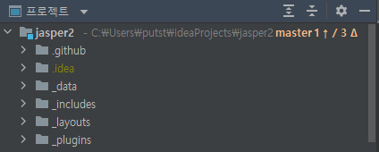
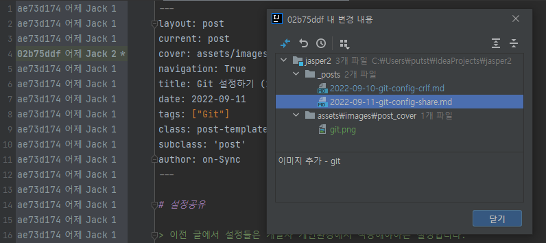
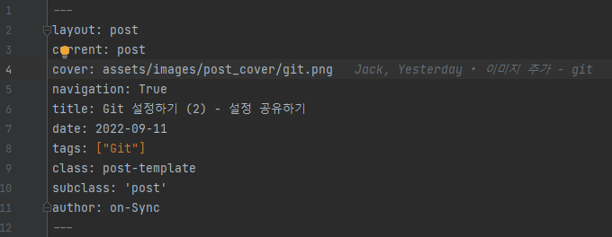
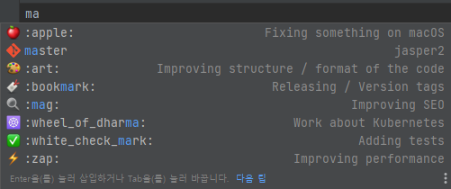
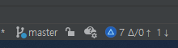
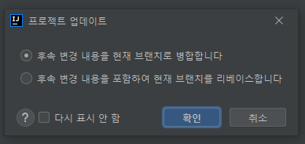

# 협업을 위한 플러그인

여러사람이 함께 일하는 프로젝트는 변화가 빈번합니다.   
그 만큼 Tracking 에 신경써야하는 노고와 시간이 필요하고요.   
물론 일하다 보면 놓치는 경우도 많기에 `GitToolBox` 라는 플러그인을 소개 드립니다.

## GitToolBox 의 기능

> 기능은 플러그인의 공식 설명에 대한 요약과 그 예시를 말씀드리겠습니다.

### 1. Git status:
    number of ahead / behind commits for current branch as status bar widget
    ahead / behind, current branch, tags on HEAD as Project View decoration on modules
    status bar widget with detailed information and additional actions

> Git status 는 `git status` 의 내용을 다음과 같이 요약하여 제공합니다.    

- 프로젝트 Window 에서 Working Directory 의 정보를 직관적으로 확인할 수 있습니다.
  - 현재 브랜치 이름 (Current Head)
  - 변경된 파일 수 (Changes File Count)
  - Remote 와 Local 의 차이 (Revision Diff)

> 위 예시를 설명해 보겠습니다.   
> 현재 Working Directory 는 `master` 브랜치를 Check out 한 상태입니다.   
> Remote 와 비교해서 Local 의 Revision 이 `1`개 Commit 로 앞선 상태이기도 합니다.   
> 마지막으로 현재 작업(변경) 중인 파일은 `3`개가 있습니다.   

### 2. Git blame:
    inline blame - show blame for line at caret in active editor
    blame details balloon for line at caret
    status bar widget with detailed information and additional actions

> Git Blame 기능은 IntelliJ 에서 기본으로 제공하고 있습니다.

> 단, 위 예시와 같이 현재 라인의 변경사유를 확인하려면 개별 Window 를 열어야 하는 번거로움이 있습니다.
> 이러한 불편함을 줄이기 위해 동적인 balloon 을 다음과 같이 제공합니다.

> 작업자는 `Add Git Blame` 으로 Editor 의 공간낭비를 하지 않아도 되고, 직관적으로 마지막 변경사유를 확인할 수 있습니다.

### 3. Auto fetch:
	runs git fetch at fixed intervals

> `fetch 자동화`는 제가 GitToolBox 를 쓰는 가장 큰 이유입니다.
> Git 은 Remote 의 최신 변경사항을 `fetch` 를 통해 확인합니다.
> __Local 에서 `fetch` 를 수행하지 않으면 `update` 필요 여부를 모르게 됩니다.__
> 이때 사용자가 `Pull Request` 를 진행하면 예기치 못한 `Conflict` 를 맞이하게 됩니다.
> 그렇게 되면 사용자는 본인의 브랜치에서 커밋을 재 정비해야하고,
> Remote 에 `Force 권한` 이 없다면 `Project Owner` 에게 번거로운 요청을 하게 될 것입니다.
> 여러 작업자가 동시에 프로젝트를 진행한다면 이런 경우는 더욱 빈번할 수도 있고요.
> 그렇기에 협업에서 Git Remote 에 대한 `fetch & update` 는 중요하고,
> 이를 판단하기 위해 사용자는 항상 Remote 의 변경유무를 인지해야합니다.

### 4. Push tags on current branch:
	available in VCS / Git

> IntelliJ 의 `Git > Push` 에서도 지원하는 기능입니다. (추천 X) 

### 5. Behind tracker
    shows notification when behind count of current branch changes and is non-zero

> 기능 1번에서 설명한 파일 변경 수에 대한 내용입니다. 

### 6. Branch name completion in Commit dialog:
    provides branch name completion inside Commit dialog message

> snippet 과 같이 dropbox 를 제공합니다.

### 7. Gitmoji completion in Commit dialog:
    provides gitmoji completion inside Commit dialog message
 
> 기능 6번과 동일한 내용입니다. 

### 8. Recent branches switcher
    switch between recently used branches

> ``Alt + ` > 7 `` 을 단순화 시킨 기능입니다. (추천 X)

### 9. Outdated branches cleanup
    find and remove merged and stale branches

> 오래된 브랜치를 삭제합니다.   
> Merge 되지 않은 브랜치는 문답을 확인을 요청합니다.
> 자동화를 위해 시간단위 주기를 설정할 수 있습니다.
> 저는 위험하다고 생각해서 사용하지 않습니다. (추천 X)

### 10. Git Extender integration
    can be selected as update action executed from behind tracker popup

> 1번 기능이 우측하단에 표시되며, 클릭시 확장통합을 위한 `Refresh Status`, `Update`, `Fetch` 등의 기능을 제공합니다.

> 그 중 `Update` 는 `Merge`, `Rebase` 를 선택할 수 있습니다.

> 이 기능은 `Pannel` 이 아닌 우측하단의 `popup` 기능을 활용할 수 있다는 것이 특징입니다.