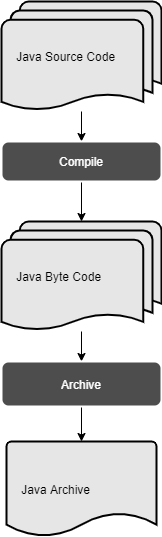

# JVM 이란 ?

JVM 은 Java 의 특징(언어적 개성)을 실현하기 위한 시스템상의 기본 스펙입니다.
JVM 의 구현체는 배포 벤더에 따라 다양합니다.
가장 대표적인 것은 Oracle 의 OpenSource JDK 의 HotSpot 을 말하곤 합니다.
즉, JVM 의 세부구현방식에 따라 차이는 존재할 수 있으나 
기본적인 시스템상의 스펙에 따른 특징은 동일합니다.

## Java 의 특징

1. 객체 지향 언어
2. 인터프리터 언어
3. 독립적인 플랫폼
4. 자동 메모리 관리
5. 멀티 쓰레딩 지원
6. 필요에 따른 동적 로딩

등등 관점에 따라 더 추가될 수 있지만 기본적으로 위 6 가지 특징으로
이후 설명되는 JVM 구성이 어떤 기능을 위해 설계 되었는지 이해할 수 있습니다.

## JVM 의 실행 순서

1. 준비 단계
   - Compiler
2. 초기화 단계
   - Class Loader
3. 실행 단계
   - Execution Engine
   - Garbage Collector

### 준비단계 - Compiler

> `인터프리터 언어` 와 `독립적인 플랫폼`

각 소스코드는 JVM 을 위한 `ByteCode` 로 컴파일하고, JVM 은 OS 별로 구현체를 달리하여 설치하여
OS 의존성이 아닌 JVM 의존성으로 설치에 따라 극복할 수 있는 구조로 의존성을 약화시킬 수 있습니다.
이때 자바 컴파일러는 CLI 상의 `javac` 를 말하고 `ByteCode` 는 `.class` 파일로 생성됩니다.
일반적으로는 여러 `.class` 를 묶어서 사용하기 위해서 한 단계를 추가하여 `.jar` 형식의 `Archive` 로 저장, 실행합니다.

### 초기화 단계 - Class Loader

> `동적 클래스 로딩`

파일형태인 `ByteCode` 는 `Class Loader` 에 의해 필요에 따라 메모리에 적재(`동적 클래스 로딩`)되어 사용됩니다.
여기서 `Class Loader` 는 크게 적재(Loading), 연결(Linking), 초기화(Initiation) 의 세가지 단계에 걸쳐
`Runtime Data Area` 중 프로세스 전역에 걸쳐 사용되는 데이터를 관리하는 `Method Area` 에 저장하게 됩니다.

적재는 파일로 저장된 `ByteCode` 를 분류를 통해 메모리 상에 보관하는 행동을 말합니다.
JVM 의 `Class Loader` 는 `Dynamic Class Loading` 방식으로 적재를 수행합니다.

`Dynamic Class Loading` 의 종류는 두 가지로 나눌 수 있습니다.

- 프로세스의 시작점인 `main` 부터 흐름에 따라 명시된 클래스 동적으로 불러오는 `Load-time Dynamic Loading`
- `Class.forName("className")` 과 같이 매개변수로 클래스를 불러오는 `Run-time Dynamic Loading`

적재되는 정보는 다음과 같습니다.

> `Reflection` 정보인 것을 확인 할 수 있습니다.

1. Class 의 `Meta` 정보인 `extends`, `implements` 와 같은 `Inheritance` 정보
2. 현재 대상의 `class`, `interface`, `enum` 과 같은 `Type` 정보
3. `Method`, `Constructor`, `Field` 와 같은 `Member` 속성의 내부정보

클래스 로더의 구조는 다음과 같습니다.

> 클래스 로더는 `Delegator` 방식으로 최상의 Bootstrap 부터 User-Defined 까지 순차적으로 각 범위에서 클래스 정보를 탐색합니다.

- Bootstrap Class Loader 는 Object 와 같이 `java.lang` 의 기본 정보를 로드하여 기본 클래스 정보를 로드합니다.
- Extension Class Loader 는 외부 `Dependencies` 들을 로드합니다.
- Application Class Loader 는 사용자가 작성한 클래스 정보를 로드합니다.

클래스 로더의 3가지 원칙

1. Delegation : 하위는 상위에 책임을 위임하여 검색한 후 자신의 범위에서 검색을 수행하며 자신의 하위에게 결과를 반환합니다.
2. Visibility : 하위는 상위결과를 얻을 수 있지만, 상위는 위임결과만을 반환합니다.
3. Uniqueness : 하위는 적재 과정 중 상위결과를 제외하므로 유일성을 보장합니다.

전체 적재 절차는 다음과 같습니다.

- ___Class Loader 가 class-path 에서 클래스를 찾지 못할 경우___
  - Exception 처리 및 RuntimeError 가 발생하게 됩니다.
- ___Class Loader 가 class-path 에서 클래스를 찾을 경우___
  - 적재 후에는 `ByteCode` 의 정상유무를 검증(Verify)합니다.
  - 검증 후에는 메모리 공간을 확보하고 유형에 따른 `기본값`을 설정하여 사전준비(Prepare)를 합니다.
  - 준비 후에는 클래스 `ByteCode` 의 `Symbolic References` 를 위한 주소값을 `Runtime Constant Pool` 에 설정하여 참조값을 풀이(Resolve)합니다.
  - 참조값 설정 후에는 `ByteCode` 에 명시된 `초기값`에 따라 데이터를 셋팅합니다.